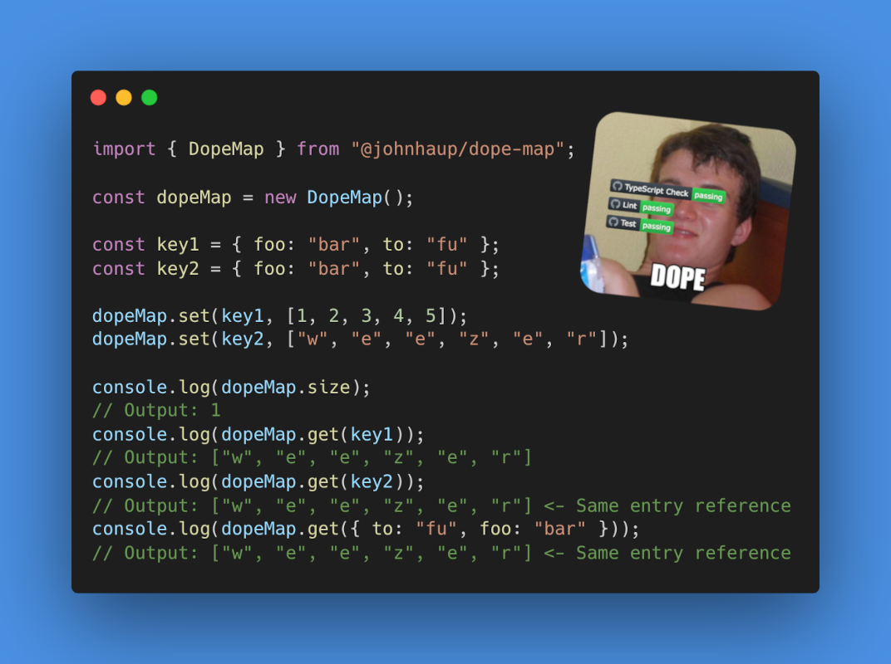
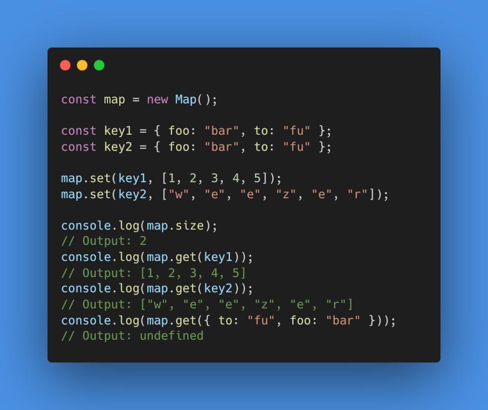

<div align="center">
  <a href="https://youtu.be/lgErexMUTC0?si=e5aRXD95TYwhgihG">
    
  </a>
</div>

# dope-map

A wrapper around [Map](https://developer.mozilla.org/en-US/docs/Web/JavaScript/Reference/Global_Objects/Map) that uses structural equality for key matching instead of the [SameValueZero algorithm](https://developer.mozilla.org/en-US/docs/Web/JavaScript/Reference/Global_Objects/Map#key_equality). This means that (for example) objects of equal but not referential value will point to the same `DopeMap` entry. This can come with a slight performance tradeoff (see [Benchmarks](#benchmarks)), so if your dataset is very large take that into consideration.

Ships with a hardcoded (dep-free) implementation of [fast-json-stable-stringify](https://github.com/epoberezkin/fast-json-stable-stringify) and [xxhashjs](https://github.com/pierrec/js-xxhash) as its hashing function. You can supply a different hashing function in DopeMap's config (as long as it returns a `string` or `number`).

fafo [here](https://johnhaup.github.io/dope-map)

## Installation

```bash
yarn add @johnhaup/dope-map
```

## Comparison

<div>
    
    
</div>

## API Reference

_In addition to standard Map methods_

#### Config

DopeMaps constructor accepts a second `config` argument.

```javascript
import { DopeMap } from "@johnhaup/dope-map";
import hashIt from "hash-it";

const dopeMap = new DopeMap(null, { hashFunction: hashIt });
```

| Property       | Type                                 | Description                                     |
| -------------- | ------------------------------------ | ----------------------------------------------- |
| `hashFunction` | `(key: unknown) => string \| number` | Custom hashing function for non-primitive keys. |

#### Methods

| Method       | Return Value                                     |
| ------------ | ------------------------------------------------ |
| `getEntries` | Array of `[key, value]` tuples in order of entry |
| `getKeys`    | Array of keys in order of entry                  |
| `getValues`  | Array of values in order of entry                |

### Typescript

`DopeMap's` generics are flipped from traditional `Map`:

```typescript
DopeMap<Value, Key = unknown> // Map<Key = any, Value = any>
```

Key is optional so you can just type the value and go crazy with the keys you pass.

## Examples

#### API Cache

```javascript
import { DopeMap } from "@johnhaup/dope-map";

const apiCache = new DopeMap();

const filters = {
  category: "electronics",
  priceRange: [100, 500],
  tags: ["sale"],
};

async function fetchProducts(query) {
  if (apiCache.has(query)) {
    console.log("Cache hit");
    return apiCache.get(query);
  }

  console.log("Cache miss");
  const response = await fetch(`/api/products?${new URLSearchParams(query)}`);
  const data = await response.json();

  apiCache.set(query, data);
  return data;
}

await fetchProducts(filters);
await fetchProducts({
  priceRange: [100, 500],
  category: "electronics",
  tags: ["sale"],
}); // <- Cache hit
```

#### Product Lookup

```typescript
import { DopeMap } from "@johnhaup/dope-map";

type ProductAttributes = {
  color: string;
  size: string;
  material: string;
};

type Product = {
  id: string;
  price: number;
  promoPrice: number | null;
  title: string;
};

const initialEntries: [ProductAttributes, Product][] = [
  [
    { color: "blue", size: "sm", material: "cotton" },
    { id: "13nl54l", title: "Cool Blue", price: 24.99, promoPrice: null },
  ],
  [
    { color: "blue", size: "xs", material: "cotton" },
    { id: "909sadfj", title: "Cool Blue", price: 19.99, promoPrice: 9.99 },
  ],
];

const productMap = new DopeMap<Product>(initialEntries);

interface Props {
  filters: Partial<ProductAttributes>;
}

function SelectedProduct({ filters }: Props) {
  const product = useMemo(() => {
    return productMap.get(filters);
  }, [filters]);

  if (!product) {
    return null;
  }

  return (
    <div>
      <p>{product.title}</p>
      <p>{product.price}</p>
      <p>{product.promoPrice}</p>
    </div>
  );
}
```

## Benchmarks

_Each Dope/Map grows to the iteration size. Averages of method time are below. All times are in milliseconds._

<!-- BENCHMARK RESULTS START -->
### OBJECTS keys
#### 100 entries
| Map | Set | Get | Has | Delete | Clear |
|-----------|-----------|-----------|-----------|-----------|----------- |
| **Map** | 0.003 | 0.001 | 0.001 | 0.004 | 0.002 |
| **DopeMap** | 0.182 (+0.180) | 0.004 (+0.003) | 0.004 (+0.003) | 0.190 (+0.186) | 0.186 (+0.183) |
| **DopeMap w/hash-it** | 0.078 (+0.076) | 0.005 (+0.004) | 0.003 (+0.002) | 0.082 (+0.078) | 0.078 (+0.075) |
| **DopeMap V1** | 0.094 (+0.092) | 0.093 (+0.093) | 0.092 (+0.091) | 0.192 (+0.188) | 0.096 (+0.093) |

#### 1,000 entries
| Map | Set | Get | Has | Delete | Clear |
|-----------|-----------|-----------|-----------|-----------|----------- |
| **Map** | 0.026 | 0.012 | 0.010 | 0.046 | 0.026 |
| **DopeMap** | 1.9 (+1.9) | 0.049 (+0.037) | 0.028 (+0.018) | 2.0 (+1.9) | 1.9 (+1.9) |
| **DopeMap w/hash-it** | 0.789 (+0.763) | 0.058 (+0.047) | 0.029 (+0.019) | 0.874 (+0.829) | 0.785 (+0.760) |
| **DopeMap V1** | 0.958 (+0.932) | 0.957 (+0.946) | 0.927 (+0.917) | 2.0 (+1.9) | 0.971 (+0.945) |

#### 10,000 entries
| Map | Set | Get | Has | Delete | Clear |
|-----------|-----------|-----------|-----------|-----------|----------- |
| **Map** | 0.365 | 0.074 | 0.073 | 0.693 | 0.374 |
| **DopeMap** | 21.0 (+20.6) | 0.835 (+0.761) | 0.333 (+0.260) | 21.7 (+21.0) | 20.6 (+20.2) |
| **DopeMap w/hash-it** | 8.3 (+7.9) | 0.783 (+0.708) | 0.341 (+0.268) | 9.6 (+8.9) | 8.7 (+8.3) |
| **DopeMap V1** | 10.2 (+9.8) | 9.6 (+9.6) | 8.9 (+8.9) | 20.5 (+19.8) | 10.1 (+9.7) |

#### 100,000 entries
| Map | Set | Get | Has | Delete | Clear |
|-----------|-----------|-----------|-----------|-----------|----------- |
| **Map** | 5.7 | 2.6 | 2.5 | 11.0 | 5.9 |
| **DopeMap** | 230.6 (+225.0) | 13.7 (+11.2) | 7.3 (+4.8) | 246.3 (+235.2) | 229.6 (+223.6) |
| **DopeMap w/hash-it** | 116.5 (+110.8) | 15.4 (+12.8) | 15.2 (+12.6) | 140.1 (+129.1) | 117.8 (+111.9) |
| **DopeMap V1** | 138.9 (+133.2) | 121.8 (+119.3) | 106.3 (+103.8) | 258.3 (+247.2) | 139.1 (+133.1) |

### PRIMITIVES keys
#### 100 entries
| Map | Set | Get | Has | Delete | Clear |
|-----------|-----------|-----------|-----------|-----------|----------- |
| **Map** | 0.003 | 0.001 | 0.001 | 0.005 | 0.003 |
| **DopeMap** | 0.006 (+0.004) | 0.002 (+0.001) | 0.001 | 0.009 (+0.004) | 0.006 (+0.004) |
| **DopeMap w/hash-it** | 0.006 (+0.004) | 0.002 (+0.001) | 0.001 | 0.009 (+0.004) | 0.006 (+0.003) |
| **DopeMap V1** | 0.004 (+0.001) | 0.003 (+0.002) | 0.002 (+0.001) | 0.008 (+0.003) | 0.004 (+0.002) |

#### 1,000 entries
| Map | Set | Get | Has | Delete | Clear |
|-----------|-----------|-----------|-----------|-----------|----------- |
| **Map** | 0.035 | 0.014 | 0.014 | 0.069 | 0.034 |
| **DopeMap** | 0.077 (+0.043) | 0.035 (+0.021) | 0.016 (+0.002) | 0.116 (+0.047) | 0.077 (+0.043) |
| **DopeMap w/hash-it** | 0.078 (+0.043) | 0.036 (+0.022) | 0.016 (+0.002) | 0.117 (+0.048) | 0.077 (+0.043) |
| **DopeMap V1** | 0.057 (+0.022) | 0.046 (+0.032) | 0.019 (+0.005) | 0.112 (+0.043) | 0.058 (+0.024) |

#### 10,000 entries
| Map | Set | Get | Has | Delete | Clear |
|-----------|-----------|-----------|-----------|-----------|----------- |
| **Map** | 0.783 | 0.096 | 0.099 | 1.4 | 0.801 |
| **DopeMap** | 1.4 (+0.590) | 0.433 (+0.336) | 0.116 (+0.017) | 2.1 (+0.683) | 1.4 (+0.626) |
| **DopeMap w/hash-it** | 1.4 (+0.664) | 0.458 (+0.361) | 0.118 (+0.019) | 2.1 (+0.725) | 1.4 (+0.626) |
| **DopeMap V1** | 1.0 (+0.220) | 0.525 (+0.429) | 0.196 (+0.098) | 1.7 (+0.308) | 0.997 (+0.196) |

#### 100,000 entries
| Map | Set | Get | Has | Delete | Clear |
|-----------|-----------|-----------|-----------|-----------|----------- |
| **Map** | 9.9 | 1.1 | 0.993 | 20.9 | 16.3 |
| **DopeMap** | 34.0 (+24.1) | 13.5 (+12.5) | 1.8 (+0.773) | 26.2 (+5.3) | 18.9 (+2.6) |
| **DopeMap w/hash-it** | 17.6 (+7.7) | 6.7 (+5.7) | 1.6 (+0.650) | 26.8 (+6.0) | 17.5 (+1.2) |
| **DopeMap V1** | 12.2 (+2.3) | 7.9 (+6.8) | 2.7 (+1.7) | 21.7 (+0.821) | 12.5 (-3.8) |

### Real-World Patterns

#### Read-Heavy (70% Get, 20% Set, 5% Has, 5% Delete) - objects keys, 10,000 entries
| Map | Avg Time (ms) |
|-----------|-----------|
| **Map** | 0.148 |
| **DopeMap** | 0.843 (+0.695) |
| **DopeMap w/hash-it** | 0.768 (+0.620) |
| **DopeMap V1** | 10.5 (+10.4) |

#### Write-Heavy (50% Set, 30% Get, 10% Has, 10% Delete) - objects keys, 10,000 entries
| Map | Avg Time (ms) |
|-----------|-----------|
| **Map** | 0.193 |
| **DopeMap** | 0.915 (+0.722) |
| **DopeMap w/hash-it** | 0.785 (+0.592) |
| **DopeMap V1** | 7.6 (+7.4) |

#### Read-Heavy (70% Get, 20% Set, 5% Has, 5% Delete) - primitives keys, 10,000 entries
| Map | Avg Time (ms) |
|-----------|-----------|
| **Map** | 0.139 |
| **DopeMap** | 0.245 (+0.106) |
| **DopeMap w/hash-it** | 0.243 (+0.104) |
| **DopeMap V1** | 0.301 (+0.162) |

#### Write-Heavy (50% Set, 30% Get, 10% Has, 10% Delete) - primitives keys, 10,000 entries
| Map | Avg Time (ms) |
|-----------|-----------|
| **Map** | 0.199 |
| **DopeMap** | 0.314 (+0.115) |
| **DopeMap w/hash-it** | 0.319 (+0.120) |
| **DopeMap V1** | 0.327 (+0.128) |

### Memory Usage

#### 1,000 entries - objects keys
| Map | Populated | After Clear | Freed |
|-----------|-----------|-----------|-----------|
| **Map** | -188.4 KB | -216.3 KB | 27.8 KB |
| **DopeMap** | 120.1 KB | 6.6 KB | 113.5 KB |
| **DopeMap w/hash-it** | 97.6 KB | 816 B | 96.8 KB |
| **DopeMap V1** | 71.7 KB | 3.5 KB | 68.2 KB |

#### 10,000 entries - objects keys
| Map | Populated | After Clear | Freed |
|-----------|-----------|-----------|-----------|
| **Map** | 222.9 KB | -1016 B | 223.9 KB |
| **DopeMap** | 920.4 KB | 81.3 KB | 839.1 KB |
| **DopeMap w/hash-it** | 862.1 KB | 4.3 KB | 857.8 KB |
| **DopeMap V1** | 635.1 KB | 1.1 KB | 634.0 KB |

#### 100,000 entries - objects keys
| Map | Populated | After Clear | Freed |
|-----------|-----------|-----------|-----------|
| **Map** | 3.50 MB | -2.5 KB | 3.50 MB |
| **DopeMap** | 11.24 MB | 797.4 KB | 10.46 MB |
| **DopeMap w/hash-it** | 11.01 MB | 2.0 KB | 11.01 MB |
| **DopeMap V1** | 7.52 MB | 11.2 KB | 7.51 MB |

#### 1,000 entries - primitives keys
| Map | Populated | After Clear | Freed |
|-----------|-----------|-----------|-----------|
| **Map** | 20.9 KB | -7.0 KB | 27.8 KB |
| **DopeMap** | 95.6 KB | 960 B | 94.7 KB |
| **DopeMap w/hash-it** | 95.6 KB | 880 B | 94.8 KB |
| **DopeMap V1** | 67.8 KB | 928 B | 66.9 KB |

#### 10,000 entries - primitives keys
| Map | Populated | After Clear | Freed |
|-----------|-----------|-----------|-----------|
| **Map** | 448.4 KB | 448 B | 447.9 KB |
| **DopeMap** | 1.26 MB | 5.0 KB | 1.26 MB |
| **DopeMap w/hash-it** | 1.26 MB | 1.2 KB | 1.26 MB |
| **DopeMap V1** | 841.6 KB | 3.2 KB | 838.4 KB |

#### 100,000 entries - primitives keys
| Map | Populated | After Clear | Freed |
|-----------|-----------|-----------|-----------|
| **Map** | 3.50 MB | -1.5 KB | 3.50 MB |
| **DopeMap** | 10.82 MB | 4.9 KB | 10.81 MB |
| **DopeMap w/hash-it** | 10.82 MB | 3.4 KB | 10.81 MB |
| **DopeMap V1** | 7.32 MB | 5.2 KB | 7.31 MB |

<!-- BENCHMARK RESULTS END -->
